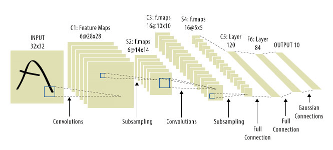
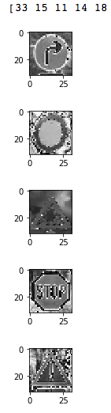
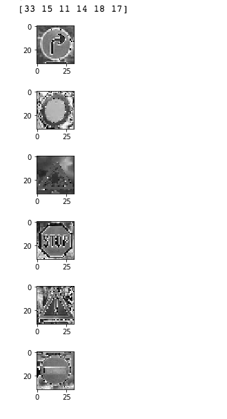

# **Traffic Sign Recognition** 

## Writeup

### You can use this file as a template for your writeup if you want to submit it as a markdown file, but feel free to use some other method and submit a pdf if you prefer.

---

**Build a Traffic Sign Recognition Project**

The goals / steps of this project are the following:
* Load the data set (see below for links to the project data set)
* Explore, summarize and visualize the data set
* Design, train and test a model architecture
* Use the model to make predictions on new images
* Analyze the softmax probabilities of the new images
* Summarize the results with a written report

[//]: # (Image References)

[image1]: ./examples/visualization.jpg "Visualization"
[image2]: ./examples/grayscale.jpg "Grayscaling"
[image3]: ./examples/random_noise.jpg "Random Noise"
[image4]: ./examples/placeholder.png "Traffic Sign 1"
[image5]: ./examples/placeholder.png "Traffic Sign 2"
[image6]: ./examples/placeholder.png "Traffic Sign 3"
[image7]: ./examples/placeholder.png "Traffic Sign 4"
[image8]: ./examples/placeholder.png "Traffic Sign 5"

## Rubric Points
### Here I will consider the [rubric points](https://review.udacity.com/#!/rubrics/481/view) individually and describe how I addressed each point in my implementation.  

---
### Writeup / README

#### 1. Provide a Writeup / README that includes all the rubric points and how you addressed each one. You can submit your writeup as markdown or pdf. You can use this template as a guide for writing the report. The submission includes the project code.

You're reading it! and here is a link to my [project code](https://github.com/udacity/CarND-Traffic-Sign-Classifier-Project/blob/master/Traffic_Sign_Classifier.ipynb)

### Data Set Summary & Exploration

#### 1. Provide a basic summary of the data set. In the code, the analysis should be done using python, numpy and/or pandas methods rather than hardcoding results manually.

I used the pandas library to calculate summary statistics of the traffic
signs data set:

* The size of training set is 34799
* The size of the validation set is 4410
* The size of test set is 12630
* The shape of a traffic sign image is (32,32,3)
* The number of unique classes/labels in the data set is 43

#### 2. Include an exploratory visualization of the dataset.

Check the visualization within the html

### Design and Test a Model Architecture

#### 1. Describe how you preprocessed the image data. What techniques were chosen and why did you choose these techniques? Consider including images showing the output of each preprocessing technique. Pre-processing refers to techniques such as converting to grayscale, normalization, etc. 
- used cv2 grayscale the images, and normalized the data using (pixel -  128)/128
- chose above because so that the data has mean zero and equal variance
- split the data into training set and validation set
- shuffle the training data 

#### 2. Describe what your final model architecture looks like including model type, layers, layer sizes, connectivity, etc.) Consider including a diagram and/or table describing the final model.

Used Lenet model architecture (with picture attached below);The model has 5 Layers:

-  Layer 1: input = 32x32x3. Output = 14 X 14 X 6  
-  Layer 2: input is 14 X 14 X 6, Output = 400.
-  Layer 3: input = 400. Output = 120
- Layer 4: Input = 120. Output = 84
- Layer 5: Input 84, output is 43

#### 3. Describe how you trained your model. The discussion can include the type of optimizer, the batch size, number of epochs and any hyperparameters such as learning rate.

trained using AdamOptimizer with the following parameters:

- epochs: 15
- batch_size: 128.
- learning rate: 0.001

#### 4. Describe the approach taken for finding a solution and getting the validation set accuracy to be at least 0.93. Include in the discussion the results on the training, validation and test sets and where in the code these were calculated. Your approach may have been an iterative process, in which case, outline the steps you took to get to the final solution and why you chose those steps. Perhaps your solution involved an already well known implementation or architecture. In this case, discuss why you think the architecture is suitable for the current problem.

model results were:

* training set accuracy of 0.98
* validation set accuracy of 0.94
* test set accuracy of 0.94

Trained using LeNet, googled a bunch and saw it's recommended on training traffic signs,  the result is good on first try:

- used the same parameter given in LeNet lab. 
- fine tuned the following parameters to get the accuracy to > 0.93:
	- epochs: 15
	- batch_size: 128.
	- learning rate: 0.001

### Test a Model on New Images

#### 1. Choose five German traffic signs found on the web and provide them in the report. For each image, discuss what quality or qualities might be difficult to classify.

all the images may have low qualities which may make it hard to classify:

- 1st image: may be misclassified as arrow pointing to straight or a right arrow
- 2nd image: no comments 
- 3rd image: the image is so low quality after grayscale
- 4th: seems straight forward
- 5th: imagehas low quality, and may be confused with other triangle signs

#### 2. Discuss the model's predictions on these new traffic signs and compare the results to predicting on the test set. At a minimum, discuss what the predictions were, the accuracy on these new predictions, and compare the accuracy to the accuracy on the test set (OPTIONAL: Discuss the results in more detail as described in the "Stand Out Suggestions" part of the rubric).

Model correctly guesses 5 out of 5

- 33 Turn right ahead
- 15 No vechiles
- 11 Right-of-way at the next intersection
- 14 Stop
- 18 General caution

#### 3. Describe how certain the model is when predicting on each of the five new images by looking at the softmax probabilities for each prediction. Provide the top 5 softmax probabilities for each image along with the sign type of each probability. (OPTIONAL: as described in the "Stand Out Suggestions" part of the rubric, visualizations can also be provided such as bar charts)

Probabilities below:

1st image:

- Value: 33, Probability: 1.000000
- Value: 11, Probability: 0.000000
- Value: 37, Probability: 0.000000
- Value: 39, Probability: 0.000000
- Value: 21, Probability: 0.000000

2nd image:

- Value: 15, Probability: 1.000000
- Value: 12, Probability: 0.000000
- Value: 2, Probability: 0.000000
- Value: 38, Probability: 0.000000
- Value: 4, Probability: 0.000000

3rd image:

- Value: 11, Probability: 1.000000
- Value: 30, Probability: 0.000000
- Value: 34, Probability: 0.000000
- Value: 23, Probability: 0.000000
- Value: 26, Probability: 0.000000

4th image:

- Value: 14, Probability: 1.000000
- Value: 38, Probability: 0.000000
- Value: 13, Probability: 0.000000
- Value: 0, Probability: 0.000000
- Value: 34, Probability: 0.000000

5th image:

- Value: 18, Probability: 1.000000
- Value: 27, Probability: 0.000000
- Value: 26, Probability: 0.000000
- Value: 28, Probability: 0.000000
- Value: 0, Probability: 0.000000

